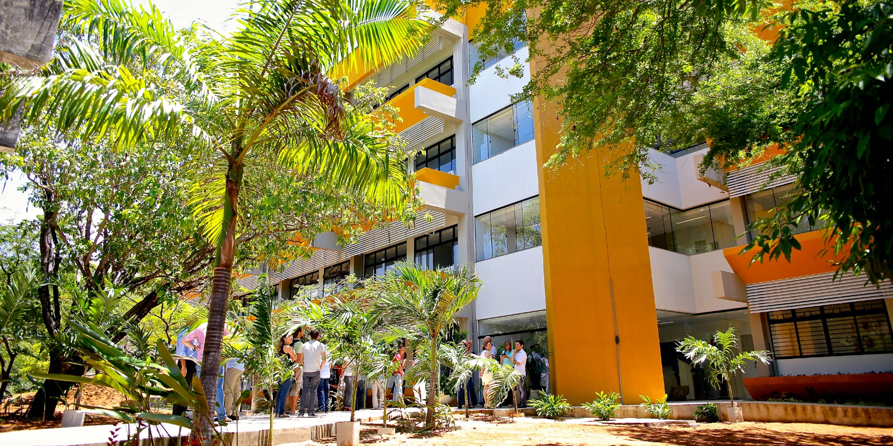

<center></center>

# Federal University of Rio Grande do Norte  
## Bioscience Center  
### Graduate Program in Ecology  
#### ECL0045 - Tópicos Especiais em Ecologia IV: Machine Learning for Life Sciences

---

## 🧭 Course Overview

This course introduces the fundamentals of **Machine Learning (ML)** with a focus on real-world applications in the **life sciences**. The content includes theoretical concepts, hands-on notebooks, and use cases based on recent research. Classes are structured to gradually introduce students to both basic and advanced topics.

---

## 📚 Week 01 – Course Outline  
[](https://github.com/igendriz/ml-for-life-sciences/blob/main/Class01/class01.pdf)

Topics covered:

### 1. Introduction  
- What are AI, ML, and DL?  
- Real-world applications in life sciences  

### 2. ML Fundamentals  
- Visualization and Exploratory Data Analysis (EDA)  
- Features, distance, and neighborhood  
- Dimensionality Reduction  
- Unsupervised ML  
- Supervised ML – Classification  

### 3. Applications  
- Ovitrap Data Analysis  
- Fish Choruses  
- Shrimp Feeding Sound Detection  
- Marine Species Identification  
- Cyclic Voltammetry for Syphilis/HIV Detection  
- DNA Sequence Analysis for Virus Classification  

---

## 📁 Repository Structure

```plaintext
ml-for-life-sciences/
│
├── README.md                  ← This file
├── requirements.txt           ← Notebooks dependencies (optional)
│
├── Images/                    ← Images used in the README or presentations
│   └── CB_UFRN.jpeg
│
├── Dataset/                   ← Datasets used in the notebooks
│   └── LBW_Data.csv           ← Accessible via direct GitHub URL for Colab
│
├── Class01/                   ← Week 1 materials
│   ├── class01.pdf            ← Slides
│   └── notebook_01.ipynb
│
├── Class02/
├── Class03/
├── Class04/
├── Class05/
├── Class06/
└── ClassXX/                   ← Future classes
```

> 💡 Notebooks are designed to be run in [Google Colab](https://colab.research.google.com/).  
> Datasets are referenced via **raw GitHub links** and loaded directly using `pandas.read_csv(...)`.

---

## 📖 Learning Resources

- [Kaggle Python Course](https://www.kaggle.com/learn/python) – A quick-start track to strengthen Python skills.
- [AI Python for Beginners (Andrew Ng)](https://www.deeplearning.ai/short-courses/ai-python-for-beginners/) – Learn Python basics and AI tools for data analysis.

---

## 📑 Referenced Publications

The following papers were used to illustrate real ML applications in life sciences during the course:

- **Dengue Forecasting (Sci Rep, 2022)**  
  [Link](https://doi.org/10.1038/s41598-022-10512-5)

- **Ovitrap Dynamics (CBIC 2023)**  
  `Deep Learning-Based Ovitrap Spatial Dynamics Analysis for Arbovirus Vector Monitoring`  
  [DOI: 10.21528/CBIC2023-056](https://doi.org/10.21528/CBIC2023-056)

- **Fish Choruses (Frontiers in Antennas and Propagation, 2024)**  
  [DOI: 10.3389/fanpr.2024.1400382](http://dx.doi.org/10.3389/fanpr.2024.1400382)

- **Shrimp Feeding Detection (Aquaculture, 2025)**  
  [DOI: 10.1016/j.aquaculture.2024.741645](http://dx.doi.org/10.1016/j.aquaculture.2024.741645)

- **DNA Virus Classification (bioRxiv, 2024)**  
  [DOI: 10.1101/2024.03.12.24304158](http://dx.doi.org/10.1101/2024.03.12.24304158)

- **Syphilis/HIV Detection (Computers in Biology and Medicine, 2024)**  
  [DOI: 10.1016/j.compbiomed.2024.108454](http://dx.doi.org/10.1016/j.compbiomed.2024.108454)

---

## 🧪 Developed by  
**Prof. Ignacio Sánchez-Gendriz**  
Machine Learning & Signal Processing for Life Sciences  
Federal University of Rio Grande do Norte (UFRN)  
